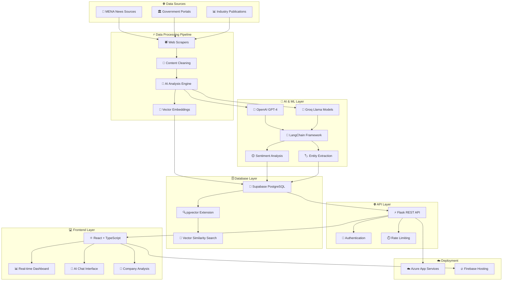
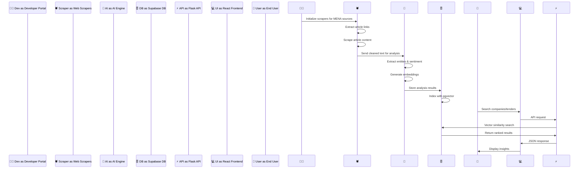

# ProcureIntel - Real-Time MENA Procurement Sentiment Intelligence

**🚀 Live URL:** [https://procumentintel.web.app/](https://procumentintel.web.app/)

**👨‍💻 Built by:** Rohit Kumar

**📂 Repository:** [GitHub](https://github.com/Rohitw3code/ProcureIntel-Real-Time-MENA-Procurement-Sentiment-Intelligence)

---

*AI-powered procurement intelligence platform for the Middle East and North Africa region*

## 🎯 Overview

ProcureIntel is an AI-powered procurement intelligence platform designed for the Middle East and North Africa (MENA) region. It transforms how organizations discover tender opportunities, analyze market sentiment, and extract actionable insights from thousands of news sources across the region.

## 💼 Use Cases

<table>
<tr>
<td align="center">🏢 <b>Enterprise Procurement</b> Automated tender discovery</td>
<td align="center">📊 <b>Market Research</b> Real-time sentiment analysis</td>
<td align="center">🤝 <b>Business Development</b> AI-powered company intelligence</td>
<td align="center">🏛️ <b>Government Agencies</b> Market transparency monitoring</td>
</tr>
</table>

## 🛠️ Tech Stack

**Frontend**
- React
- TypeScript
- Tailwind CSS
- Vite

**Backend**
- Python
- LangChain
- OpenAI
- Groq
  
**Database & Infrastructure**
- Supabase
- Azure
- Firebase
- Vector
  
## 🔄 System Architecture

## 🔄 Workflow Process

## 📸 Screenshots

<table>
<tr>
<td width="50%">
<h4>🏠 Home Landing Page with Chatbot</h4>

</td>
<td width="50%">
<h4>📊 Dashboard for Sentiment Analysis</h4>

</td>
</tr>
<tr>
<td width="50%">
<h4>🔍 AI Search Bar</h4>

</td>
<td width="50%">
<h4>🏢 Company Analysis Page</h4>

</td>
</tr>
<tr>
<td width="50%">
<h4>👨‍💻 Developer Portal</h4>

</td>
<td width="50%">
<h4>🕷️ Scraper Selection in Developer Portal</h4>

</td>
</tr>
<tr>
<td colspan="2" align="center">
<h4>🗄️ Supabase Database Structure</h4>

</td>
</tr>
</table>

## ✨ Key Features

| Feature | Description |
|---------|-------------|
| 🤖 **AI-Powered News Monitoring** | 24/7 monitoring of MENA news sources |
| 😊 **Real-Time Sentiment Analysis** | Advanced NLP for market sentiment tracking |
| 🎯 **Smart Tender Discovery** | Automated procurement opportunity identification |
| 💬 **Interactive AI Chatbot** | Natural language querying of procurement data |
| 🏢 **Company Intelligence** | Comprehensive sentiment profiles and risk analysis |
| 🔍 **Vector Search** | Semantic similarity search using embeddings |
| 👨‍💻 **Developer Portal** | Pipeline management and data processing tools |

## 🚀 Deployment

- **Backend**: Azure App Services
- **Frontend**: Firebase Hosting
- **Database**: Supabase (PostgreSQL with pgvector)
- **AI Models**: OpenAI GPT-4, Groq Llama
- **Vector Embeddings**: OpenAI text-embedding-3-small

---

**🌟 Transforming MENA procurement with AI intelligence 🌟**

